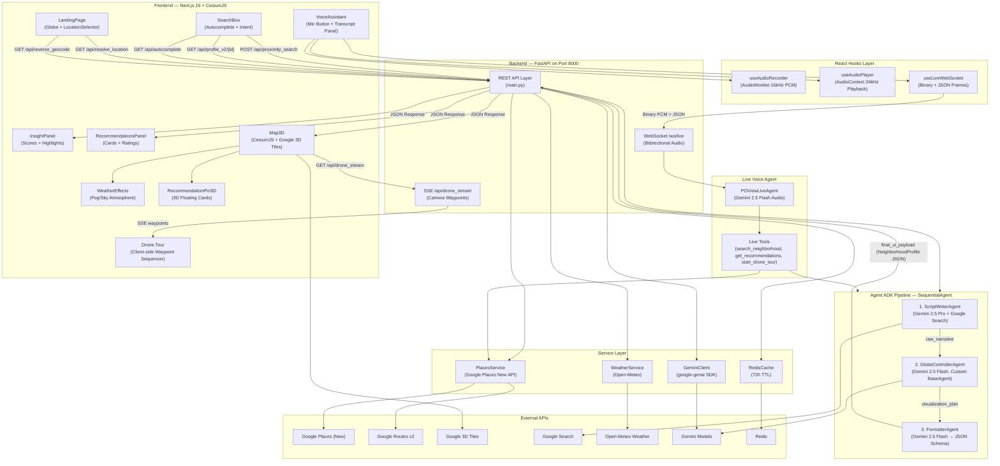
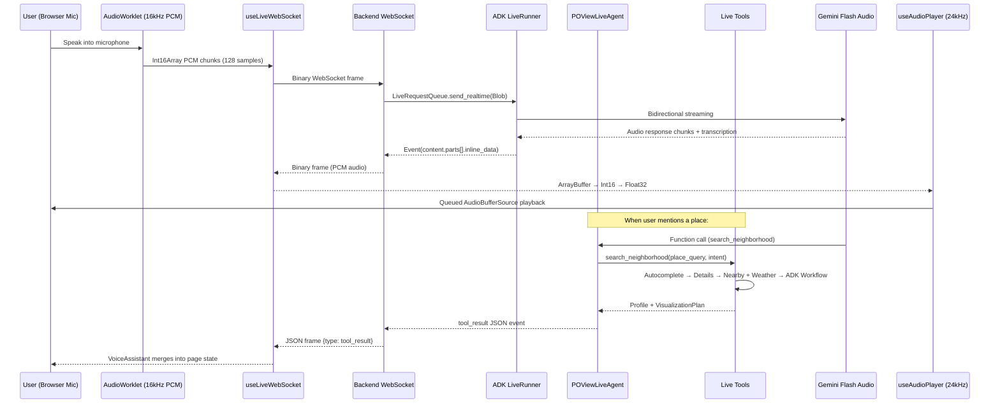
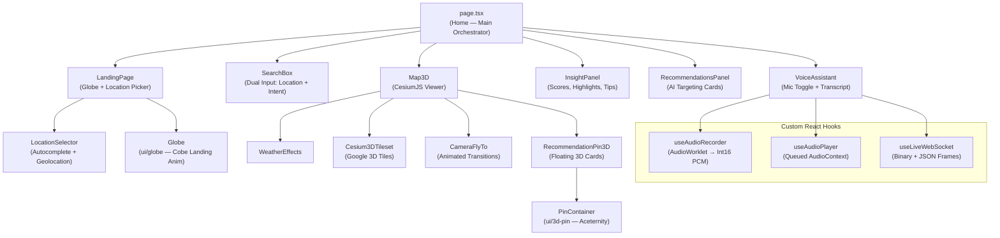

# POView — Architecture Review Document

> **Date**: March 15, 2026  
> **Version**: V5.1 (live voice pipeline fully integrated)  
> **Repository**: `gods_eye` (codename) → branded as **POView**

---

## 1. Project Summary — Features & Functionality

**POView** is an autonomous urban intelligence platform that translates abstract, natural-language intent into rich, AI-generated neighborhood analysis overlaid on an immersive 3D globe. It combines real-time Google Places data, Gemini-powered reasoning, live weather context, and cinematic CesiumJS visualization into a single vertical slice.

### Core Features

| Feature | Description |
|---|---|
| **Contextual Neighborhood Profiling** | A user types a location + free-text intent (e.g., "quiet café in Williamsburg"). The system resolves the place, aggregates nearby POI data, fetches live weather, and invokes Gemini to generate a structured `NeighborhoodProfile` with scores, highlights, insider tips, and demographic fit assessments. |
| **AI Proximity Search** | Uses Gemini to parse the user's intent into Places API keywords, then searches within a configurable radius, returning up to 5 geo-tagged recommendations with actual walking route polylines rendered on the 3D map. |
| **Autonomous Drone Camera Tours** | An Agent ADK pipeline extracts POIs from a narrative, computes camera waypoints (altitude, heading, pitch), and streams them via SSE. The frontend plays them as a cinematic flyover sequence on the CesiumJS globe. |
| **Live Voice Assistant** | A fully implemented bidirectional WebSocket + Gemini Live API agent (`gemini-2.5-flash-native-audio-preview`) enables real-time voice-based neighborhood exploration. The frontend captures mic audio via an `AudioWorklet` (16kHz PCM), streams it over WebSocket, and plays back 24kHz PCM responses through a queued `AudioContext` player. The agent has tool access to `search_neighborhood`, `get_recommendations`, and `start_drone_tour` — tool results are merged into the same UI state pipeline as text search, enabling seamless voice → visual transitions. |
| **Weather-Adaptive 3D Visualization** | Real-time weather data from Open-Meteo influences both the AI-generated prose (vibe descriptions are adapted to current conditions) and the Cesium globe visuals (fog density, sky saturation, brightness). |
| **Glassmorphic Premium UI** | Landing page with animated globe, floating search with autocomplete, left-side insight panel with lifestyle scores and highlights, and right-side recommendation cards — all styled with a dark glassmorphism aesthetic. |

---

## 2. Technology Stack

### Backend

| Technology | Purpose |
|---|---|
| **Python 3.11** | Runtime |
| **FastAPI** | REST API framework (async) |
| **Google Agent Development Kit (ADK)** | Orchestrates multi-agent AI workflows (`SequentialAgent`, `LlmAgent`, `BaseAgent`) |
| **Google Gemini API** (`google-genai` SDK) | All LLM inference — structured JSON generation, intent parsing, narrative writing, POI extraction |
| **Pydantic v2** | Schema validation, Gemini structured output schemas |
| **Redis** (async via `redis.asyncio`) | Caching layer with 72-hour TTL for generated profiles |
| **Uvicorn** | ASGI server with hot reload |
| **httpx** | Async HTTP client for external API calls |
| **polyline** | Decodes Google Routes encoded polylines |

### Frontend

| Technology | Purpose |
|---|---|
| **Next.js 16** (Turbopack) | React framework, SSR/CSR |
| **React 19** | UI library |
| **TypeScript** | Type safety |
| **CesiumJS + Resium** | 3D globe rendering, camera flights, entity overlays |
| **Tailwind CSS 4** | Styling (glassmorphism, dark mode) |
| **Axios** | HTTP client for backend API calls |
| **Lucide React** | Icon system |
| **Web Audio API + AudioWorklet** | Real-time mic capture (16kHz Int16 PCM) and audio playback (24kHz) for the voice pipeline |
| **WebSocket (native)** | Bidirectional binary + JSON streaming for live voice sessions |

### Infrastructure

| Component | Details |
|---|---|
| **Redis Server** | Local instance on port 6379 |
| **Backend Server** | `localhost:8000` (Uvicorn) |
| **Frontend Server** | `localhost:3000` (Next.js) |

---

## 3. External Data Sources & APIs

| Data Source | API Used | Purpose |
|---|---|---|
| **Google Places (New)** | `places.googleapis.com/v1/places:autocomplete` | Location autocomplete suggestions |
| **Google Places (New)** | `places.googleapis.com/v1/places/{id}` | Place details (coordinates, viewport, address) |
| **Google Places (New)** | `places.googleapis.com/v1/places:searchNearby` | Nearby POIs within radius for Gemini context |
| **Google Places (New)** | `places.googleapis.com/v1/places:searchText` | Keyword-based contextual search for recommendations |
| **Google Routes v2** | `routes.googleapis.com/directions/v2:computeRoutes` | Walking directions encoded as polylines |
| **Google Geocoding** | `maps.googleapis.com/api/geocode/json` | Reverse geocode (lat/lng → place ID) for "Use My Location" |
| **Google Photorealistic 3D Tiles** | `tile.googleapis.com/v1/3dtiles/root.json` | Full 3D city rendering in CesiumJS |
| **Cesium Ion** | Ion asset token | Globe terrain and base map |
| **Open-Meteo** | `api.open-meteo.com/v1/forecast` | Real-time weather (temp, precipitation, wind, cloud cover, WMO weather codes) |
| **Google Search (via ADK)** | `google_search` tool in Agent ADK | Grounding real-time facts in the ScriptWriter agent narrative |
| **Gemini 3.1 Pro Preview** | Structured JSON generation | Neighborhood profiles, intent parsing, comparative analysis |
| **Gemini 2.5 Pro** | Narrative text generation | ScriptWriter agent (free-form 400-600 word text) |
| **Gemini 2.5 Flash** | Lightweight extraction + formatting | GlobeController POI extraction, Formatter JSON structuring |
| **Gemini 2.5 Flash Native Audio** | Live API bidirectional audio | Voice assistant real-time conversations |

---

## 4. System Architecture — Visual Representation

---

## 5. Data Flow — End-to-End Search Pipeline

The following describes what happens when a user types "quiet café near Williamsburg" and hits **Search**:

```mermaid
sequenceDiagram
    participant U as User
    participant FE as Frontend (Next.js)
    participant BE as Backend (FastAPI)
    participant Redis as Redis Cache
    participant Places as Google Places API
    participant Routes as Google Routes API
    participant Weather as Open-Meteo
    participant Gemini as Gemini Models
    participant ADK as Agent ADK Pipeline

    U->>FE: Types location + intent, clicks Search
    FE->>BE: POST /api/proximity_search (place_id, intent, radius)
    FE->>BE: GET /api/profile_v2/{place_id}?intent=... (concurrent)

    rect rgb(40, 40, 60)
        Note over BE,Gemini: Proximity Search Flow
        BE->>Places: Get place details (lat/lng)
        BE->>Gemini: Parse intent → keywords
        BE->>Places: Text search within bounding box
        BE->>Routes: Compute walking routes (parallel for each result)
        BE-->>FE: Return recommendations + polylines
    end

    rect rgb(40, 60, 40)
        Note over BE,ADK: V2 Profile Flow
        BE->>Redis: Check cache (v2_{place_id}_{intent})
        alt Cache Hit
            Redis-->>BE: Return cached profile
        else Cache Miss
            BE->>Places: Get details + nearby POIs
            BE->>Weather: Fetch current weather
            BE->>ADK: Run 3-agent sequential workflow
            ADK->>Gemini: Agent 1 — ScriptWriter (narrative + Google Search grounding)
            ADK->>Gemini: Agent 2 — GlobeController (extract POIs → compute camera waypoints)
            ADK->>Gemini: Agent 3 — Formatter (narrative → NeighborhoodProfile JSON)
            ADK-->>BE: Return profile_data + visualization_plan
            BE->>Redis: Cache result (72h TTL)
        end
        BE-->>FE: Return profile + viewport + weather + visualization_plan
    end

    FE->>FE: Render InsightPanel (scores, highlights, tips)
    FE->>FE: Render RecommendationsPanel (cards)
    FE->>FE: Fly CesiumJS camera to neighborhood
    FE->>FE: Render 3D pins + routing polylines on globe
    FE->>FE: Apply WeatherEffects (fog, sky atmosphere)
```

### Live Voice Assistant — End-to-End Flow

---

## 6. Agent ADK Pipeline — Detailed Breakdown

### Sequential Workflow (V2 Profile)

The **V2 profile endpoint** uses a `SequentialAgent` from Google ADK that chains three specialized agents:

| # | Agent | Model | Role | Output |
|---|---|---|---|---|
| 1 | **ScriptWriterAgent** | `gemini-2.5-pro` | Writes a 400-600 word grounded narrative about the neighborhood using Google Search for real-time fact verification. Embeds specific place names with coordinates. | `raw_narrative` (free text) |
| 2 | **GlobeControllerAgent** | `gemini-2.5-flash` | Custom `BaseAgent` that extracts POIs from the narrative, then deterministically computes CesiumJS camera waypoints (establishing shot → POI flyovers → return). | `visualization_plan` (waypoints array) |
| 3 | **FormatterAgent** | `gemini-2.5-flash` | Strict JSON formatter that structures the raw narrative into the `NeighborhoodProfile` Pydantic schema (scores, highlights, tips, best_for, etc.) | `final_ui_payload` (structured JSON) |

The pipeline is orchestrated by `workflow.py`, which builds an `InMemorySessionService`, creates the `SequentialAgent`, and extracts results from session state. JSON output from LLM calls is sanitized via `json_utils.py` (strips markdown code fences before parsing).

### Live Voice Agent

The **Live Voice Agent** (`live_agent.py`) is a standalone `Agent` using `gemini-2.5-flash-native-audio-preview` for bidirectional audio streaming. It exposes three tools defined in `live_tools.py`:

| Tool | Purpose | Backend Bridge |
|---|---|---|
| `search_neighborhood(place_query, intent)` | Full neighborhood analysis — resolves place via autocomplete, fetches details + nearby + weather, then runs the complete 3-agent sequential workflow. | `get_autocomplete_predictions` → `get_places_details` → `get_nearby_places` + `fetch_weather_forecast` → `run_neighborhood_workflow` |
| `get_recommendations(place_query, intent, radius)` | Targeted place recommendations — resolves location, parses intent to keywords, searches via `contextual_places_search`. | `get_autocomplete_predictions` → `get_places_details` → `parse_contextual_intent` → `contextual_places_search` |
| `start_drone_tour(place_query)` | Returns a signal payload that the frontend intercepts to trigger the client-side drone tour animation. | Returns `{action: "start_drone_tour"}` (frontend handles playback) |

---

## 7. Pydantic Data Models

The system uses strongly-typed Pydantic schemas both for Gemini structured output and internal data flow:

| Model | Location | Purpose |
|---|---|---|
| `NeighborhoodProfile` | `models.py` | Core profile schema: name, tagline, vibe, scores (7 dimensions), highlights, insider tip |
| `IntentKeywords` | `models.py` | Gemini output for intent → keywords conversion |
| `ComparativeAnalysis` | `models.py` | Two-location comparison (planned feature) |
| `CinematicNarrative` | `models.py` | "Day in the Life" narrative with place mentions (planned feature) |
| `CommuteAnalysis` | `models.py` | Transit/commute evaluation (planned feature) |
| `CameraWaypoint` | `agents/models.py` | Single drone flight segment: lat, lng, altitude, heading, pitch, duration, pause_after |
| `VisualizationPlan` | `agents/models.py` | Full drone tour: ordered waypoints + total duration |
| `ExtractedPOI` | `agents/models.py` | POI with coordinates extracted from narrative text |
| `TranscriptLine` | `hooks/useLiveWebSocket.ts` | Voice transcript entry: role (user/agent), text, finished flag |

---

## 8. Frontend Component Architecture

### Voice-to-Visual State Merge

`page.tsx` drives all UI state via top-level `useState` hooks. Both the text search path (`handleSearch`) and the voice path (`handleVoiceSearchResult`) converge into the same state setters (`setProfileData`, `setViewport`, `setLocation`, `setWeatherState`, `setDroneWaypoints`, `setRecommendations`), ensuring a seamless experience regardless of input modality. The drone tour playback (`handleDroneTour`) runs entirely client-side by iterating through `droneWaypoints` with `setTimeout`, feeding each waypoint to `Map3D` as `activeDroneWaypoint`.

---

## 9. Findings & Learnings

### Architectural Strengths
- **Token Efficiency**: Redis caching with 72h TTL minimizes redundant Gemini API calls. The cache key combines `place_id + intent` for granular deduplication.
- **Concurrent API Orchestration**: `Promise.all` on the frontend and `asyncio.gather` on the backend for parallel API calls maximize throughput.
- **Agent Composability**: The ADK `SequentialAgent` cleanly separates concerns (research → compute → format), making each agent independently testable and replaceable.
- **Structured Output Discipline**: Every Gemini call uses `response_schema` with Pydantic models, ensuring the frontend always receives predictable JSON shapes.
- **Graceful Degradation**: Weather fallbacks to defaults, directions fallback to straight-line paths, and autocomplete failures are all handled silently.

### Areas for Improvement
- **API Keys in `.env`**: Keys are currently hardcoded in plaintext `.env` files. For production, consider Google Secret Manager or Vault.
- **No Authentication**: All endpoints are publicly accessible. CORS is restricted to localhost but there's no user auth layer.
- **Backend Error Logging**: Uses `print()` statements; a structured logging framework (e.g., `structlog`) would improve observability.
- **V1 vs V2 Endpoint Duplication**: Both `/api/profile/{id}` (V1, direct Gemini call) and `/api/profile_v2/{id}` (V2, ADK pipeline) exist. V1 could be deprecated.
- **Frontend State Management**: All state lives in the top-level `page.tsx` via `useState`. As complexity grows, a state management solution (Zustand, Jotai) would reduce prop drilling. The voice pipeline adds additional state vectors (`voiceState`, `transcript`, `panelVisible`) that compound this concern.
- **Missing Tests**: No automated test suite for the core pipeline. The `test_*.py` files in the backend root are individual API scripts, not a proper test framework.
- **Live Agent Error Handling**: The `ConnectionClosedOK` exception (`1000 None`) from Gemini's WebSocket is logged but not gracefully communicated to the frontend user. The agent should send a structured close-reason message before the socket terminates.
- **Audio Worklet Path**: The AudioWorklet processor sits at `public/audio-recording-worklet.js` as a static file — it cannot be type-checked or bundled. Consider inlining via Blob URL or using a build plugin.

### Key Design Decisions
1. **Google Places New API** over Legacy: Chosen for the field-mask pattern that reduces response payload size and cost.
2. **Open-Meteo over Google Weather**: Free, no-API-key weather data used as a proxy since Google Weather APIs have limited availability.
3. **Three Gemini Models**: The `gemini-2.5-pro` handles the heavy reasoning (narrative writing), while `gemini-2.5-flash` handles lightweight tasks (extraction, formatting) for speed and cost optimization. `gemini-3.1-pro-preview` is used for the V1 structured profile generation.
4. **CesiumJS over Mapbox/Google Maps JS**: Chosen for native 3D globe support, photorealistic Google 3D Tiles integration, and programmatic camera control (essential for drone tours).
5. **SSE for Drone Streaming**: Server-Sent Events were chosen over WebSocket for the drone tour because the data flow is unidirectional (server → client waypoints).

---

## 10. API Endpoint Summary

| Method | Endpoint | Purpose |
|---|---|---|
| `GET` | `/api/autocomplete?input=` | Proxy for Google Places Autocomplete |
| `GET` | `/api/resolve_location/{place_id}` | Resolve place ID → coordinates |
| `GET` | `/api/reverse_geocode?lat=&lng=` | Reverse geocode lat/lng → place ID |
| `POST` | `/api/proximity_search` | AI-powered contextual place recommendations |
| `GET` | `/api/profile/{place_id}?intent=` | V1 neighborhood profile (direct Gemini) |
| `GET` | `/api/profile_v2/{place_id}?intent=` | V2 neighborhood profile (ADK agents) |
| `GET` | `/api/drone_stream/{place_id}?intent=` | SSE stream of camera waypoints |
| `WS` | `/ws/live/{session_id}` | Bidirectional voice assistant (Gemini Live) |
